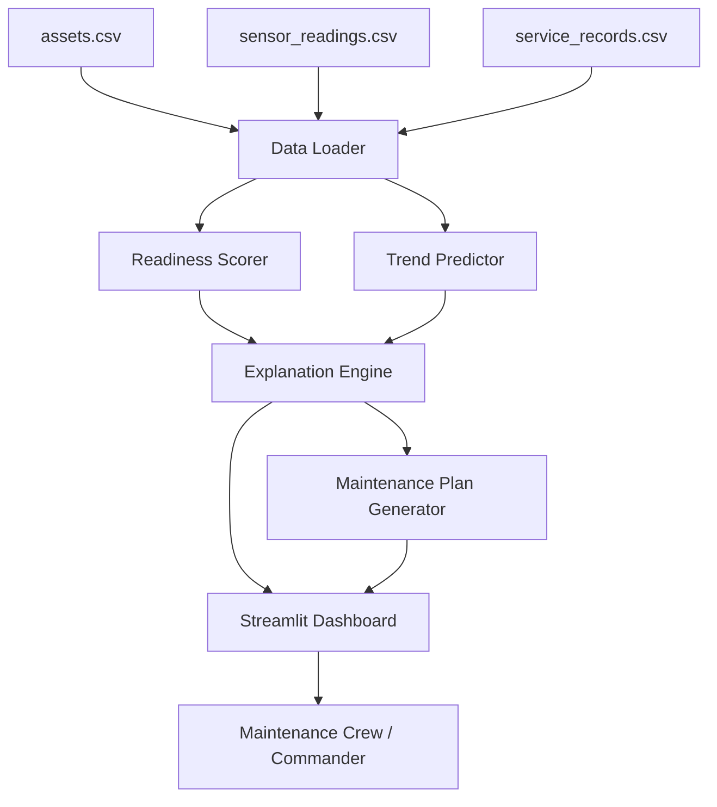

# Architecture

## System diagram

## Component table

| Component | Technology | Responsibility |
|---|---|---|
| Data Loader | pandas | Reads and joins asset, sensor, and service-record data |
| Readiness Scorer | Python (pandas/numpy) | Compares latest sensor values to thresholds and service intervals; produces per-component and per-asset risk scores |
| Trend Predictor | numpy (linear regression) | Extrapolates recent sensor history to estimate days-to-failure per component |
| Explanation Engine | Python | Turns scores into plain-language, component-level explanations |
| Maintenance Plan Generator | Python | Ranks all flagged components fleet-wide into a single prioritised action list |
| Dashboard | Streamlit | Interactive fleet view, per-asset drill-down, sensor trend charts, maintenance plan export |
| IBM Bob | Bob IDE (Plan / Agent / Ask modes) | Used to plan the pipeline architecture, scaffold the scoring/prediction modules, generate this architecture diagram, and review the final implementation via `/review` |

## Data flow (end-to-end)
1. `data_generator.py` produces (or, in production, a real HUMS export provides)
   `assets.csv`, `sensor_readings.csv`, and `service_records.csv`.
2. The Data Loader joins these into one in-memory table per asset/component.
3. The Readiness Scorer computes a risk score per component (threshold deviation +
   calendar overdue) and rolls it up to an asset-level readiness status.
4. The Trend Predictor fits a linear trend over each component's recent sensor history
   and estimates a failure date, converted to "days to failure."
5. The Explanation Engine attaches a human-readable reason to every flagged component.
6. The Maintenance Plan Generator sorts all flagged components fleet-wide by
   (risk score, urgency) into one prioritised list.
7. The Streamlit dashboard renders the fleet table, per-asset detail with trend charts,
   and the maintenance plan, all from the same underlying scored dataset.

## Where IBM Bob is load-bearing (not just mentioned)
- **Plan mode** was used to design the module boundaries (Data Loader / Scorer /
  Predictor / Explanation / Plan Generator) before writing code.
- **Agent mode** implemented `predictor.py` and `app.py` from that plan.
- **`/erd`-style diagramming** in Bob produced the first draft of the diagram above,
  refined here.
- **`/review`** was run against the scoring and prediction logic before submission to
  catch edge cases (e.g. components with too little sensor history to trend).
- *(Fill in your team's actual Bob session notes/screenshots here before submitting —
  judges specifically score whether Bob was genuinely used, not just named.)*

## Security & scalability notes
- No real credentials or PII in this hackathon build — all data is synthetic.
- `src/.env.example` documents any config needed if extended to connect to a real HUMS
  data source or database.
- The scoring pipeline operates on a pandas DataFrame in memory; for a production fleet
  (thousands of assets, streaming sensor data), the Data Loader would be swapped for a
  streaming ingestion layer (e.g. Kafka + a time-series DB) feeding the same scoring
  logic — the scoring/prediction/explanation modules are already decoupled from the
  data source to make that swap straightforward.
